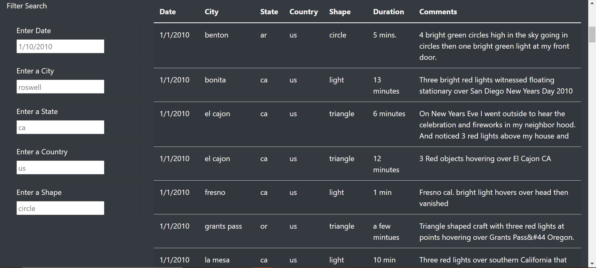
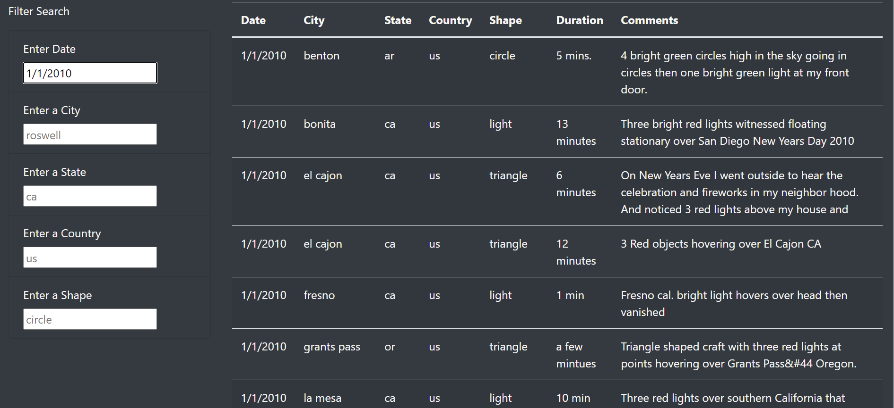
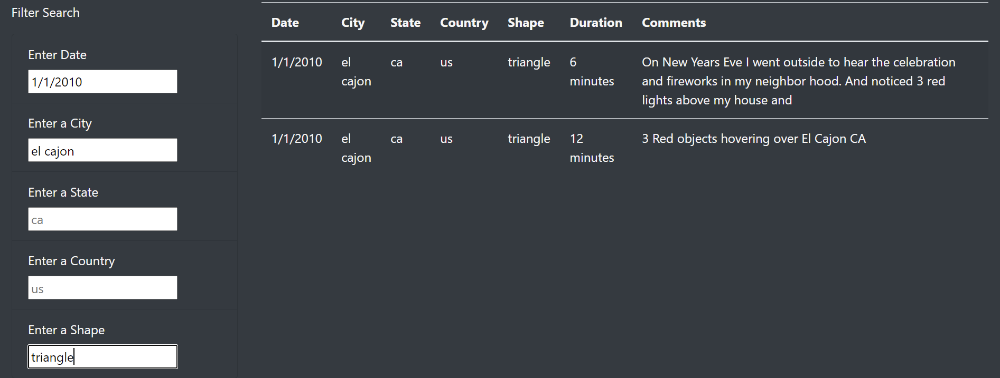

# UFOs
## Project Overview
In the following project, we used HTML, CSS, and JavaScript to create a dynamic webpage with a table that users can filter to explore UFO data. The UFO data contained different instances of UFO encounters in a JSON format. The massive JSON data object was subjected to various JavaScript functions to parse the data into a dynamic HTML table that users could filter. Using JavaScript logic and its innate ability to be linked with HTML's DOM, we made it easier for users to navigate UFO data. 

## Resources
- HTML & CSS
  - Bootstrap Version 4.0
- JavaScript
  - D3 Version 4.11

## Results
When users initially engage with the webpage, the homepage presents them with a table with all the UFO data in the JSON object. Scrolling through the data can be overwhelming, so we created filters with the JavaScript D3 library to filter the data by date, city, state, county, or shape. The user can filter the data with one search field or a combination of search fields. 
#### Initial Homepage:

#### Using One Filter:
The user can choose how many filters they want to apply. The example below shows just one filter applied in the date search field.

#### Using Multiple Filters
The user can mix and match the filters they want to apply. The example below shows the date, city, and shape search fields applied to filter the data in the table. The user is able to get more specific results for their analysis by applying multiple filters. 

After the user deletes the search input and clicks anywhere on the table, the table resets. By using a combination of search fields, the user can pinpoint events of interest and draw their own conclusions. 

## Summary
The new design only helps users filter if they already know specific details about the data. One would have to skim through the entire table to get an idea of what cities or dates are available to search, for example. If we put a random date or city in the search input box, there is a chance that no results will be found. 

We can improve the user experience by changing the input boxes to dropdown menus that display the available cities or dates. It would make it easier for the users to know what filters are available to them rather than blindly inserting search criteria that yield no results. We could also improve the page to include the metrics of specific search criteria. For example, what if a user wanted to know how many UFO sightings were in a particular shape. Rather than inputting the shape of interest and then counting how many rows match the search criteria, we could display the row total to save the user time. 
